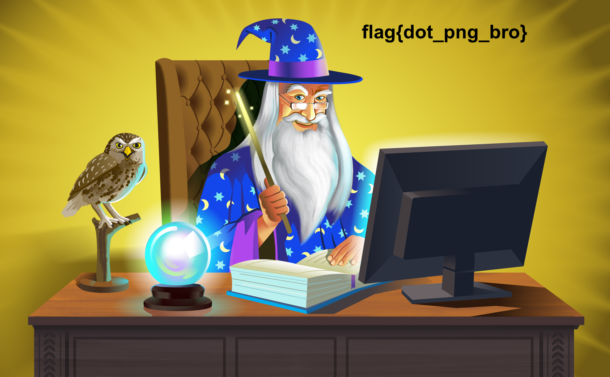

# AHS CTF 11/10

## Tasks:
[[1] Here ya go!](#1-here-ya-go)

[[25] ABC… it’s as easy as 123…](#25-abc-its-as-easy-as-123)

[[50] Extension Cord](#50-extension-cord)

[[25] Ass Key](#25-ass-key)

[[75] Swift Swiftly](#75-swift-swiftly)


## [1] Here ya go!
**Problem:**

[here_ya_go.txt](https://drive.google.com/file/d/1OAv-eUr64hIWnsYqCZE6Qwb3gwo1DjjR/view)

**Solution:**

The flag is located inside the text file. Opening it produces `flag{well_that_was_easy}`.

## [25] ABC… it’s as easy as 123…
**Problem:**

Gabe passes secret notes to Gabby in class without the teacher noticing, but I managed to intercept one. The problem is, there’s no words! What does this mean?

6-12-1-7 { 5-1-19-25 _ 1-19 _ 15-14-5 _ 20-23-15 _  20-8-18-5-5 }

**Solution:**

This is a A1Z26 cipher, and inputting the encrypted text into an online decoder produces the result `flag{easy_as_one_two_three}`.

## [50] Extension Cord
**Problem:**

My file isn’t working! Please fix it. [extension_cord.txt](https://drive.google.com/file/d/1433OBKxxtQbfvm185LXRsiu25nLS7e0P/view)

Hint: Computers need a way to tell different types of files apart.

**Solution:**

By running `file extension_cord.txt` which outputs `extension_cord.txt: PNG image data, 1920 x 1188, 8-bit/color RGB, non-interlaced`, we learn that
the file is of a PNG format. Renaming extension_cord.txt to extension_cord.png and opening gives us `flag{dot_png_bro}`.



## [25] Ass Key

**Problem:**

I stole this straight off the server’s hard drive, but it doesn’t make any sense. Maybe these numbers mean something?

0110011001101100011000010110011101111011010000010101001101000011010010010100100101011111011010010111001101011111010001010101101001111101

Hint: Computers encode legible text as binary numbers using a certain format.

**Solution:**

This text is obviously in binary, so using an online decoder will produce `flag{ASCII_is_EZ}`.

## [75] Swift Swiftly

**Problem**

Aha! You know Swift, right? Try to hack into this for me. [swiftSwiftly.swift](https://drive.google.com/file/d/1zu4Tr1eZqQm4Q-a0ppbaGWFsCvyZsy8N/view)

**Solution**

I actually don't know Swift. However, scanning the code reveals that the flag is encoded within this function:

```swift
func checkPassword(password:String) -> Bool {
    let arr = Array(password)
    return password.count == 31 &&
      arr[0]  == "s" &&
      arr[29] == "o" &&
      arr[4]  == "t" &&
      arr[2]  == "i" &&
      arr[23] == "r" &&
      arr[3]  == "f" &&
      arr[17] == "a" &&
      arr[1]  == "w" &&
      arr[7]  == "s" &&
      arr[10] == "w" &&
      arr[5]  == "_" &&
      arr[9]  == "a" &&
      arr[11] == "e" &&
      arr[15] == "e" &&
      arr[8]  == "_" &&
      arr[12] == "s" &&
      arr[20] == "_" &&
      arr[14] == "m" &&
      arr[6]  == "i" &&
      arr[24] == "a" &&
      arr[18] == "n" &&
      arr[13] == "o" &&
      arr[19] == "d" &&
      arr[21] == "a" &&
      arr[16] == "_" &&
      arr[27] == "_" &&
      arr[30] == "o" &&
      arr[25] == "y" &&
      arr[22] == "r" &&
      arr[28] == "t" &&
      arr[26] == "s"
}
```

From this, we can rebuild the flag by looking at the array indexes. Wrapping the result in a `flag{}` gives us `flag{swift_is_awesome_and_arrays_too}`.
